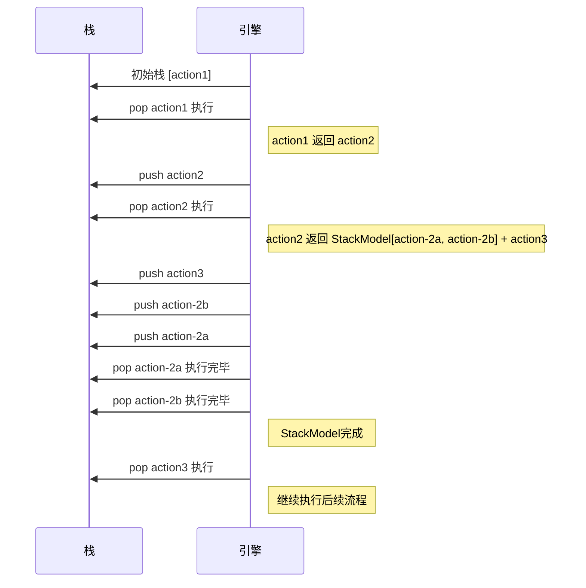
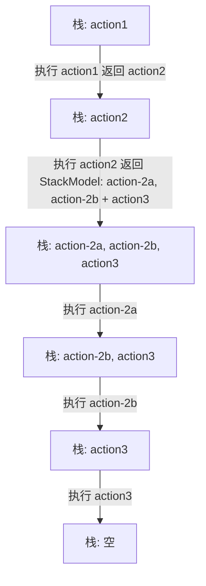

# StackModel是如何改变我的游戏引擎的

## 引言

StackModel 是为 NarraLeaf-React 设计的一套以栈为中心的执行模型。它统一管理嵌套剧情、异步任务与状态序列化
，从根本上解决了传统“单节点”执行模型在支线、嵌套和存档恢复上的不足。本文将说明为什么需要 StackModel、其核心
概念（Awaitable、Timeline、栈循环）、以及实现要点与常见陷阱。

有关于NarraLeaf-React视觉小说框架，请参考[NarraLeaf-React](https://react.narraleaf.com/). 

本文将围绕其核心逻辑StackModel展开研究，并且解释这个设计背后的原理。

## 架构演变

### 单节点动作模型

NarraLeaf-React使用静态剧情节点树来储存游戏剧情逻辑，有关引擎基本的流程结构，请访问[NarraLeaf React背后的设计理念](../narraleaf-react-design/)

在一开始，NarraLeaf-React使用单个变量来引用当前正在执行的节点，这保证引擎可以轻松获取当前的执行状态和预测未来的节点，
该做法简单并且易于调试。但是，这个做法很快就被意识到是错误的。

随着剧情和叙事变复杂，故事中会出现嵌套的操作，也就是可选或额外的独立于主线的操作。当使用单个变量来引用当前正在执行的节点时，
为了保证运行完嵌套的动作后能回归到原本的时间线，游戏不得不将嵌套动作最后一个动作的子节点指向绑定到主线上的下一个节点。  
此时，游戏节点会变为：  
```
              (extra-1) -↓
(action-1) -↑              (action-2) -> (...)
```

但是，这个做法在遇到循环和选择性支线的情况时会变得难以调试、难以理解并且令人混淆。游戏不得不在存档中维护一个增量映射表来储存节点
之间的关系。而依赖于修改和读取节点指向的执行流程管理让错误更难以发现，流程追踪变得更为复杂。  
更重要的是，这个做法打破了NarraLeaf-React的核心设计原则：剧情节点树静态特性

剧情节点树是NarraLeaf-React依赖的重要结构。这个节点树构建了剧情走向，每个节点包含的信息和节点之间的关系。强制剧情节点树静态
特性可以让剧情逻辑易于调试和追踪，避免了维护和记录节点树变更的必要，并且有助于引擎对剧情节点进行静态分析和预测。

打破这个特性不仅违背了引擎的设计哲学，还导致了相当多危险而令人困惑的特性。

### StackModel动作模型

StackModel动作模型是一次重大的架构演进，也是NarraLeaf-React对于剧情管理的最终尝试。

这次转变引入了：  
- 显式的可等待/可中断的原子任务处理（Awaitable）
- 递归任务子栈
- 完整的序列化/反序列化能力
- 可中断并且可恢复的任务模型
- 时间线模型（Timelines）
- 游离任务的控制

总而言之，这次转变带来了完整的嵌套操作解决方案，并且提供了完整的游戏中断、恢复到任意时刻和序列化支持。

该方案围绕着几个核心概念构建：  
- 尝试性的操作执行
- 嵌套的执行栈
- 方便序列化和反序列化的游戏状态快照

这次更新彻底解决了单节点动作模型存在的所有功能，并且为后来的游戏存档/读档和游戏历史记录提供了支持。

## StackModel概念

StackModel不仅指的是StackModel结构本身，也指的是包含Timelines和Awaitable在内的统一设计概念。

### Awaitable

Awaitable是StackModel执行任何异步任务的的原子操作。

Awaitable是可以解析、链接或中止的异步值的包装器，它本质上是对Promise概念的扩展和修改。  
它与Timeline紧密合作，并且在Timeline中充当广播子任务状态的成员。

Awaitable追踪任务的状态，包括正在等待、已解决和已终止三个状态。它没有已拒绝状态，因为Awaitable不被预期处理任务的错误
情况，因为Awaitable充当游戏节点的状态跟踪器，而在任何游戏节点中发生错误都是无法容忍的，并且会立即导致剧情终止。

### Timeline和Timelines

Timeline是对多个Awaitable和嵌套Timeline任务的高级封装，是协调异步操作和动画的核心系统。它为各种异步操作（例如动画、音频播放和等待用户
输入）提供统一的生命周期管理。

直观来讲，Timeline通常被用于监听多个Awaitable和Timeline的多个状态，包括向下传播和向上监听。  
Timeline的状态也包含正在等待、已解决和已终止。

Timeline通常以`all`和`any`模式执行，也就是等待所有Awaitable和嵌套Timeline解析以及等待其中任何一个任务解析。

Timeline使用一个任务相关或临时拟造的Awaitable充当其主要的状态控制器。当主Awaitable中断时或Timeline自身被中断时，整个
Timeline都会中断。当Timeline中断时，其所有的子任务，包括Awaitable和Timeline都会中断，并且向下递归传递。

而Timelines则是全局根时间线管理器，用于立即中断所有受管理的时间线。该类确保不会存在不受控的游离时间线没有正确响应游戏状态变更。

### StackModel

StackModel是一组以栈形式储存的Awaitable和节点。

简单来讲，当节点执行完后，其执行结果，也就是下一个节点或一个未解析的Awaitable，会推入栈。每次进行栈循环时，StackModel
都会尝试取出栈顶的内容并且继续执行。

详细来讲，栈在循环时会做这些事情：  
- 如果栈已空，退出循环并且交给游戏决定下一步操作
- 取出栈顶
  - 如果栈顶是可执行的节点，则执行该节点，将执行结果推入栈
  - 如果栈顶是包含未执行的StackModel的可执行节点，则执行其指向的StackModel
  - 如果栈顶是已解析的Awaitable，将结果推入栈
    - 如果没有任何结果返回，什么都不会发生
  - 如果栈顶是未解析的Awaitable，返回Awaitable供调用者监听任务执行状态



而栈看起来像是：  


这意味着操作可以返回某组连续节点的第一个节点，栈会自动执行那组节点，并且在结束后回归上一层栈。这个设计让游戏无需再变更任何
节点数据以做到栈回归。

操作使用StackModel来管理任务很简单。当操作返回下一个节点时，可以返回一个StackModel的初始化参数以及下一个节点，也可以返回
一组带有执行父子关系的节点。  

当返回StackModel初始化参数和下一个节点时，一个新的StackModel会被初始化和执行，执行完成后下一个节点会被推入栈。  
当返回一组操作时，操作会正向遍历并且推入栈。这意味着操作返回的每个操作都是一组节点序列的开头。每个节点序列都会按照推入顺序
的反方向执行。

当场景跳转时，主StackModel会清空，以免任何来自其他场景的操作意外执行。

### 序列化和反序列化

上文曾提到过StackModel的核心设计之一就是“尝试性的操作执行”。

在JavaScript执行环境中，我们无法得知任何Promise的内部状态，除非其主动报告。我们也无法直接中止某个Promise的执行。  
由于语言限制，我们需要做一些取舍：抛弃部分异步执行结果并且返回到一个稳定的时刻。

当序列化游戏时，游戏会序列化所有注册的StackModel。

StackModel序列化时，会按照以下流程执行：  
- 如果栈顶是一个正在执行的StackModel，则序列化StackModel并将其数据储存和子节点在内包含在序列化后的栈上
- 如果栈顶是一个未解析的Awaitable，不储存这个Awaitable
- 如果栈顶是一个节点，储存该节点的ID

在反序列化时，游戏会将序列化的栈中的所有元素反序列化：  
- 当遇到节点，从已经构建完成的静态脚本树中查找该节点的实例并且替换
- 当遇到StackModel数据，使用这个数据构建一个新的StackModel和子节点引用

任何独立的异步执行的StackModel也遵循同样的流程。

### 历史管理

由于栈通常不会很深，因此序列化和反序列化StackModel并不会产生较大的性能影响。因此，游戏在每个操作执行时，都会推入一个StackModel快照。

游戏状态是通过记录状态增量或使用清理函数来实现的。当回溯到某个时刻时，在那个时刻之前的清理函数会执行，并且将涉及到的StackModel通过快照还原。

## 未来方向

尽管StackModel是一个足够合理的解决方案，但它依旧存在很多缺陷。

例如，StackModel的错误处理依赖游戏上下文，缺少足够的方案来处理或允许开发者处理节点执行错误。  
同时，StackModel的序列化和反序列化依赖于静态节点树特性，这意味着对脚本的任何更改都会导致存档完全不兼容。  
又或者，StackModel的并发控制过于简单，可能无法处理过于复杂的游戏逻辑。

这些问题都需要深入的研究和实验才能得到解决方法，但这将会是NarraLeaf-React努力的目标！
